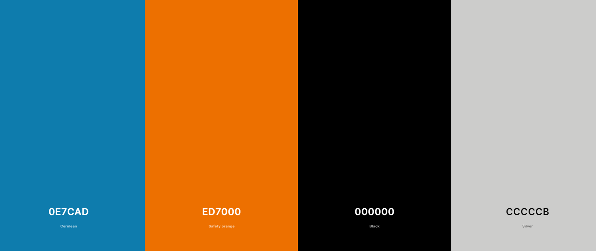

<br>

## 1. Overview

The Orient Auto is a user-friendly web application designed to simplify vehicle browsing and booking processes.

<br>

## 2. Description

The Orient Auto provides a seamless online experience for individuals seeking to explore and rent cars. With a straightforward interface, users can effortlessly view a selection of available vehicles and conveniently make bookings. The platform is designed to streamline the process of finding the perfect vehicle for your needs. Additionally, users can access information about suitable pickup and drop-off locations, ensuring a smooth and tailored experience for their travel plans.

<br>
The project provides the following features:
<br>
<br>

**1. User Registration and Authentication:**

Users can create accounts and log into the platform using traditional registration. These processes enable users to access various platform features.

<br>

**2. View Available Vehicles:**

On the Orient Auto website, the user can browse available vehicles and their details.

<br>

**3. Booking and Reservation:**

Any user can book their own vehicle according to their needs in terms of specifications, pick-up, and drop-off locations.

<br>

**4. User booking history:**

The user can view the details of his reservation history if he was previously registered.

<br>

## 3. Link and Preview


Project link is available at [Orient Auto App](https)

<br>

## 4. Color guide



<br>

## 5. Built with

<p align="left">


</p>

<br>
<br>

## 6. Project Setup

To set up the Orient Auto project, follow these steps:

<br>

1. Navigate to the main directory of the project.

2. Run the command `npm install` at the main, client and server directories to install the necessary dependencies for both the server and client components.

3. After the dependencies are installed, run `npm run start` at the client and server directories to run the application.

<br>

Please note that additional configuration steps and requirements may exist. Refer to the project documentation for more detailed instructions and troubleshooting information.

<br>

## 7. Code structure

```
client
└── public
    └── images
    └── index.html
└── src
    └── components
        └── banner
            └── Banner.jsx
            └── Banner.css
        └── footer
            └── Footer.jsx
            └── Footer.css
        └── forms
            └── RegisterForm.jsx
            └── RegisterForm.css
            └── VautourForm.jsx
            └── VautourForm.css
        └── home
            └── banner
                └── HeroSectio.jsx
                └── HeroSectio.css
            └── bokking
                └── Booking.jsx
                └── Booking.css
            └── download
                └── Download.jsx
                └── Download.css
            └── faq
                └── FAQ.jsx
                └── FAQ.css
            └── plan
                └── Plan.jsx
                └── Plan.css
            └── vehicleModel
                └── VehicleModel.jsx
                └── VehicleModel.css
            └── whyUs
                └── WhyUs.jsx
                └── WhyUs.css
        └── navigationBar
            └── NavBar.jsx
            └── NavBar.css
        └── orderCard
            └── OrderCard.jsx
            └── OrderCard.css
        └── popupMessage
            └── PopUpMessage.jsx
            └── PopUpMessage.css
        └── showFooter
            └── ShowFooter.jsx
        └── showNavBar
            └── ShowNavBar.jsx
        └── vautour
            └── Vautour.jsx
            └── Vautour.css
    └── context
        └── authContext.js
    └── mutations
        └── addUser.js
        └── addVautour.js
        └── loginUser.js
    └── pages
        └── style
            └── About.css
            └── ContactUs.css
            └── Login.css
            └── Orders.css
            └── Profile.css
            └── Register.css
            └── Team.css
            └── Vehicles.css
        └── About.jsx
        └── ContactUs.jsx
        └── Login.jsx
        └── Orders.jsx
        └── Profile.jsx
        └── Register.jsx
        └── Team.jsx
        └── Vehicles.jsx
    └── queries
        └── allVehiclesQueryex.js
        └── locationsQuery.js
        └── reservations.js
        └── userInfo.js
        └── vehicleById.js
        └── vehicleCategories.js
        └── vehicleQuery.js
    └── apolloClient.js
    └── App.js
    └── App.css
    └── index.js
    └── index.css

server
└── db
    └── connectDB.js
└── models
    └── car.js
    └── category.js
    └── location.js
    └── reservation.js
    └── user.js
└── schema
    └── schema.js
└── src
    └── app.js
README.md
```
